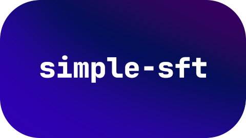

<p align="center">
    
</p>

<h1 align="center">simple-sft</h1>

<p align="center">
    <i>The most beautiful, functionally complete instruct datasets at your fingertips.</i>
</p>

**`simple-sft` is an all-in-one solution for creating beautiful, extensive and versatile datasets used for instruct fine-tuning large language models (LLMs).**

## Usage

Get started with:

```bash
# Install the dependencies
python3 -m venv ./.venv && . ./.venv/bin/activate
pip install -r ./requirements.txt
cp ./config.example.yml ./config.yml
cp ./.env.example ./.env

# Run simple-sft on your machine!
python3 ./src/main.py
```

This project is still under very active development and in its early stages. It
is thus not usable in production yet.
Open an issue if you have any questions.

## License

This project is licensed under the MIT license.
See the [`LICENSE`](./LICENSE) file to learn more.
